# 시연 시나리오: 관계도로 도면을 고치고, 관계도로 도면을 그린다

발표자가 그대로 따라 하면 되는 대본이다. 전체 10분, 두 부분으로 나뉜다.

| 부 | 내용 | 시간 | 보여 주는 것 |
|---|---|---|---|
| 1부 | 있는 도면을 고친다 | 5분 | 회의에서 나온 변경 지시를 관계도에서 처리하고, 실제 도면에 반영하고, 맞게 반영됐는지 확인 |
| 2부 | 백지에서 새로 그린다 | 5분 | 대지경계선만 있는 상태에서 관계도를 쌓아, 치수와 일람표까지 있는 도면을 뽑음 |

**한 문장으로**: 도면의 선을 하나씩 고치는 대신 "기둥, 벽, 보, 문, 창호가 서로 어떻게 붙어 있는가"를 고치면, 선과 치수와 설비 위치는 따라온다.

이 문서의 숫자와 그림은 모두 저장소에 올린 파일로 실제로 돌려서 얻은 것이다. 확인 방법은 맨 끝에 있다.

---

## 시연 전 준비 (5분 전)

1. 한 번만: `pip install -r requirements.txt`, 그리고 `bash tools/setup_from_drawings.sh`
2. 아래 파일 네 개를 미리 더블클릭해서 브라우저 탭으로 열어 둔다.

| 탭 | 파일 | 쓰는 곳 |
|---|---|---|
| ① | `1_편집기_열기.bat` | 1부를 직접 조작 |
| ② | `0_예시_편집_상태로_열기.bat` | 1부의 끝 상태 (조작이 막히면 이 탭으로) |
| ③ | `4_새_프로젝트_시작.bat` | 2부를 직접 조작 |
| ④ | `6_시나리오_새_프로젝트_끝_상태_보기.bat` | 2부의 끝 상태 (조작이 막히면 이 탭으로) |

3. 브라우저의 다운로드 폴더에 예전 `changes_*.json`이 있으면 지운다. `2_도면에_반영.bat`은 가장 최근 파일을 쓴다.
4. AutoCAD까지 보여 줄 거면 AutoCAD를 미리 켜 둔다. 켜는 데 시간이 걸린다.
5. 상단의 전기·설비·소방 체크는 처음에 **꺼 둔다.** 1부 3단계에서 켠다.

---

## 1부. 있는 도면을 고친다 (5분)

**상황**: 근린생활시설 1층 평면도. 설계 변경 회의에서 지시가 여섯 건 나왔다.

> ① 상가 전면 기둥열(X6)을 500 옮긴다 ② 화장실 창을 큰 것으로 바꾼다 ③ 화장실 문을 900으로 바꾼다
> ④ 계단 옆 문 하나를 없앤다 ⑤ 상가 안에 벽을 세우고 문을 낸다 ⑥ 모서리 기둥 하나를 없앨 수 있는지 본다

### 0단계. 도면이 관계도로 읽힌다 (30초)

탭 ①을 보여 준다.

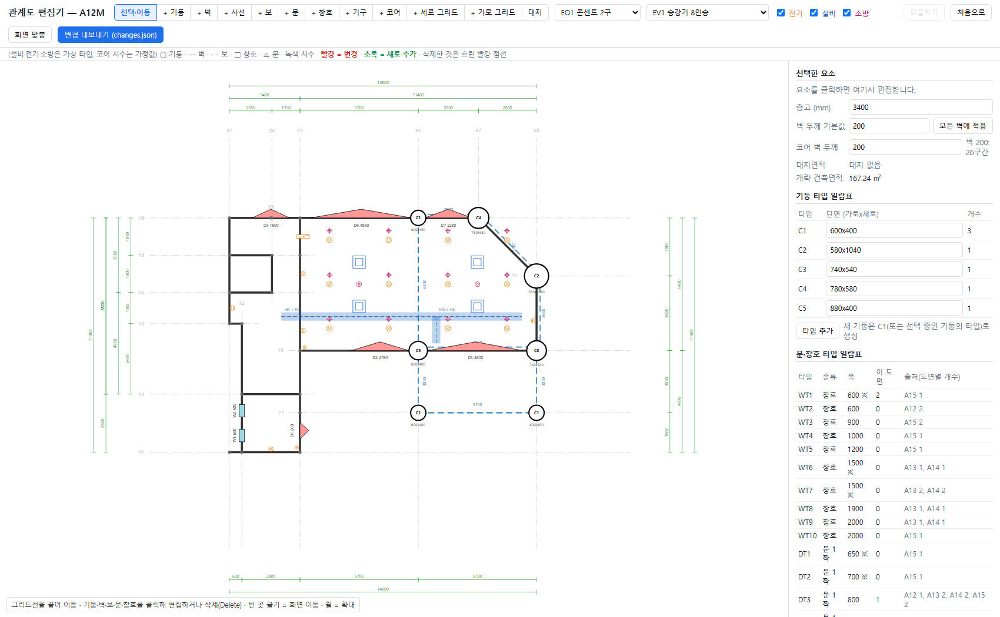

| 말할 것 | 근거 |
|---|---|
| "이 화면은 캐드 도면을 읽어서 만든 관계도입니다. 사람이 다시 그린 것이 아닙니다." | 그리드 17개, 기둥 7개, 구간 29개, 문·창호 8개, 치수 34개를 도면에서 읽음 |
| "동그라미는 기둥, 실선은 벽, 점선은 보, 네모는 창호, 세모는 문입니다." | 화면 위쪽의 범례 |
| "오른쪽 위의 사선 외벽도 그대로 읽혔습니다." | 그리드 교점 X7-Y9와 X8-Y7을 잇는 사선 구간 |
| "오른쪽 일람표는 1층부터 4층까지 도면 네 장에서 읽은 것입니다." | 창호 10종, 문 6종. 출처 칸에 도면 번호와 개수 |

### 1단계. 기둥열을 옮긴다 (1분) — 지시 ①

1. 세로 그리드선 **X6**을 클릭한다.
2. 오른쪽 "이동량"에 `500`을 넣고 **적용**.

| 화면에서 일어나는 일 | 말할 것 |
|---|---|
| X6 위의 기둥 3개가 같이 움직임 | "기둥은 그리드에 붙어 있어서 그리드를 옮기면 따라옵니다." |
| 위아래 치수가 빨갛게 바뀜: 5700 → 6200, 2900 → 2400, 5700 → 5200 | "치수는 사람이 고치지 않았습니다. 전체 치수 14800은 그대로입니다." |
| 오른쪽 "경고"에 새 항목 | 다음 단계에서 설명 |

### 2단계. 창과 문을 바꾼다 (1분) — 지시 ②③④

1. 왼쪽 아래 화장실 벽의 네모 **W2**를 클릭하고 "타입"에서 **WT3 · 폭 900**을 고른다.
2. 세모 **D1**을 클릭하고 "타입"에서 **DT4 · 폭 900**을 고른다.
3. 세모 **D3**을 클릭하고 **삭제**(또는 Delete 키).

| 말할 것 | 근거 |
|---|---|
| "창을 늘린 것이 아니라, 일람표에 있는 더 큰 창으로 바꿨습니다. 실무에서 창호는 규격품이라 이렇게 합니다." | 타입 교체 방식 |
| "WT3은 1층에는 없는 창입니다. 4층 도면에 그려진 것을 가져옵니다." | 출처 칸의 A15 |
| "지운 문 자리는 벽으로 다시 이어집니다." | 도면 반영 때 벽선 6쌍 이음 |

### 3단계. 벽을 세우고 문을 낸다, 그리고 설비를 켠다 (1분) — 지시 ⑤

1. 상단의 **전기, 설비, 소방** 체크를 켠다. 조명, 디퓨저, 스프링클러 헤드, 콘센트가 나타난다.
2. **+ 벽**을 누르고 X6 위의 Y2~Y4 구간(초록 띠)을 클릭한다.
3. **+ 문**을 누르고 맨 아래쪽 벽(Y1)에서 콘센트(주황 표시)가 있는 자리를 클릭한다.

| 화면에서 일어나는 일 | 말할 것 |
|---|---|
| 실내의 조명·헤드·디퓨저가 1단계에서 넓어진 구획에 맞춰 이미 옮겨져 있음 | "기구는 '이 구획의 몇 퍼센트 위치'로 붙어 있어서 구획이 바뀌면 다시 놓입니다." |
| 경고: "콘센트 2구: 문 D8(폭 800)와 겹침" (콘센트가 있는 자리에 문을 놓았을 때) | "문을 낸 자리에 콘센트가 있었습니다. 건축이 바꾸면 전기가 영향을 받는다는 것을 바로 알려 줍니다." |
| 경고: "덕트: 기둥 X6-Y4과 간섭(겹침 50 mm)" | "기둥을 옮겼더니 덕트와 부딪혔습니다." |
| 경고: "헤드 가로 간격 3100 mm, 기준 3000 mm 초과" | "구획이 넓어져서 스프링클러 헤드가 모자랍니다." |

설비·전기·소방 기구는 이 도면 세트에 없어서 **시연용으로 가상 배치한 것**이라고 반드시 말한다. 기준값(헤드 간격 3000, 덕트 이격 100)도 가정값이다.

### 4단계. 기둥을 없애 본다 (30초) — 지시 ⑥

1. 위쪽 벽에 있는 기둥 가운데 오른쪽 것, **X7-Y9**를 클릭하고 **삭제**.

| 화면에서 일어나는 일 | 말할 것 |
|---|---|
| 경고: "보의 지지 기둥 X7-Y9이 삭제됨. 구조 검토" | "없앨 수는 있지만, 이 기둥이 받치던 보가 있다고 알려 줍니다. 판단은 사람이 합니다." |

여기까지 하면 화면이 아래와 비슷해진다. 탭 ②는 여기에 몇 가지를 더한 끝 상태(변경 14건, 경고 12건)다.

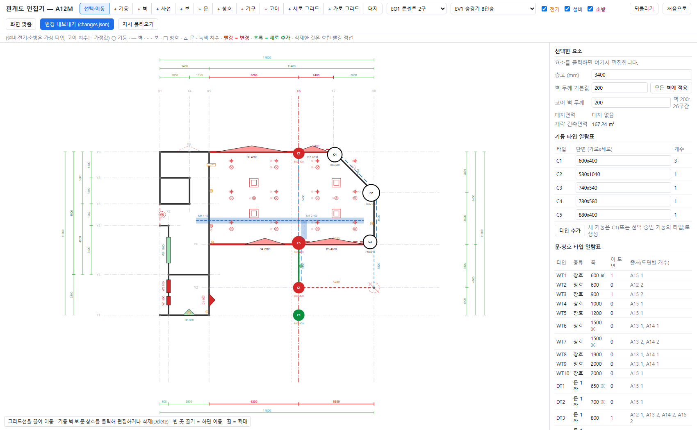

빨강은 바뀐 것, 초록은 새로 넣은 것, 흐린 빨강 점선은 지운 것이다.

### 5단계. 실제 도면에 반영한다 (1분)

1. 오른쪽 아래 "검토자"에 이름을 쓰고, 상단 **변경 내보내기**를 누른다.
2. `2_도면에_반영.bat`을 더블클릭한다. 1분쯤 걸린다. 기다리는 동안 아래 표를 말한다.

| 변경 | 도면에서 실제로 한 일 |
|---|---|
| X6을 500 이동 | 객체 57개 이동. 벽, 문, 마감선, 기둥, 치수가 함께 움직임 |
| 창 W2를 900으로 교체 | 4층 도면의 창호 기호 36개를 복사해 90도 돌려 놓고, 문틀 쪽 벽선 18개를 옮김 |
| 문 D1을 900으로 교체 | 2층 도면의 문 기호를 복사, 벽선 16개를 옮김 |
| 문 D3 삭제 | 객체 38개 삭제, 끊겼던 벽선 6쌍을 이음 |
| 벽 추가, 문 D8 추가 | 벽선을 그리고, 문 자리의 벽선 6개를 잘라 문 기호를 놓음 |
| 기구 | 30개 재배치(건축 변경에 따른 자동 29개, 직접 옮긴 것 1개) |

3. 그림 세 장이 열린다. 변경 전, 변경 후, 그리고 **수정된 도면에서 다시 읽은 관계도**.

| 변경 전 | 변경 후 |
|---|---|
| 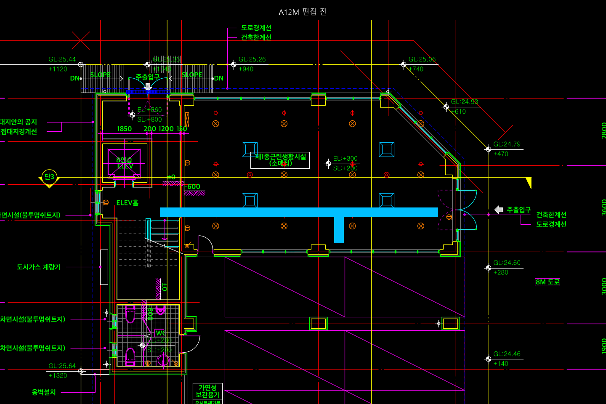 | 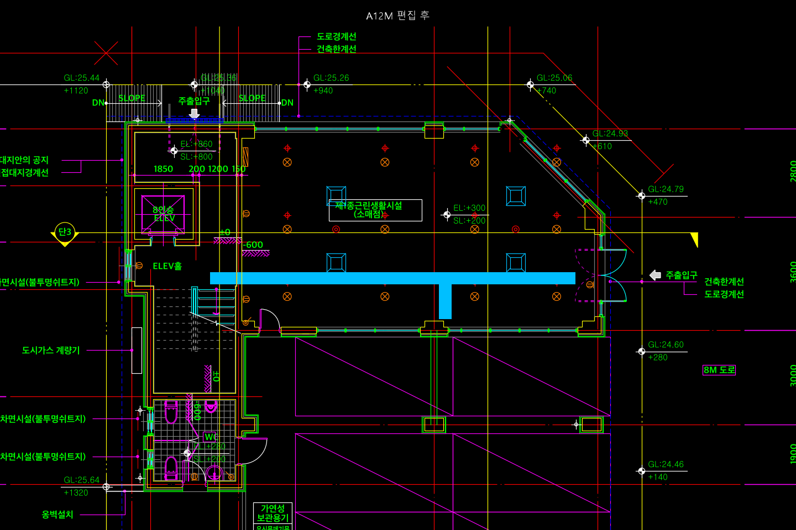 |

창을 옮기고 바꾼 자리를 확대한 것:

| 변경 전 | 변경 후 |
|---|---|
| 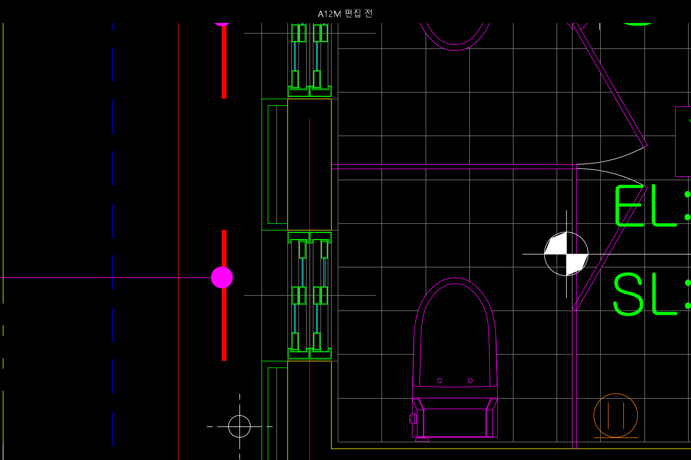 | 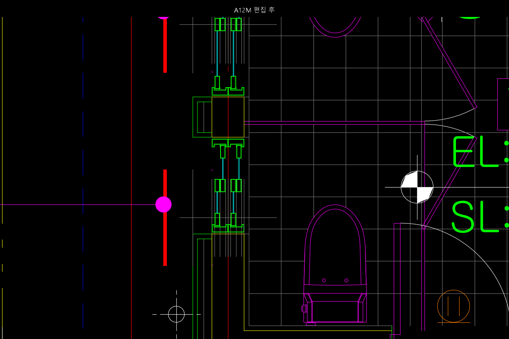 |

문을 새로 낸 자리를 확대한 것:

| 변경 전 | 변경 후 |
|---|---|
| 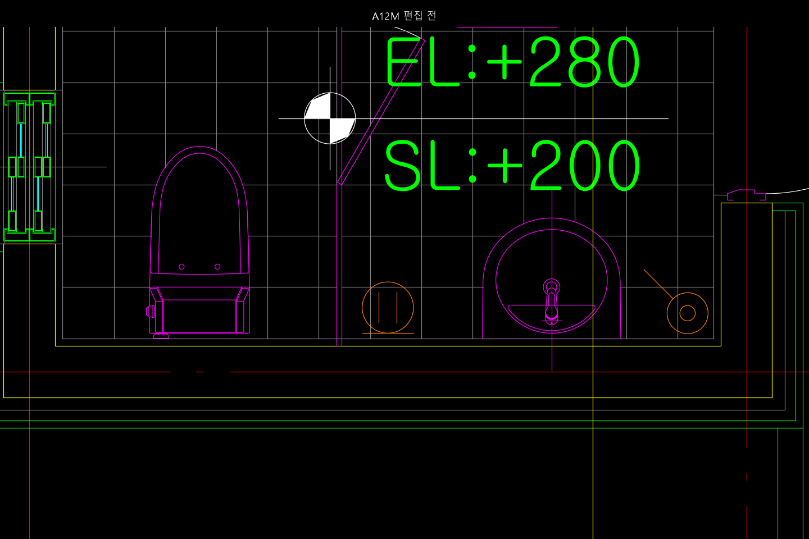 | 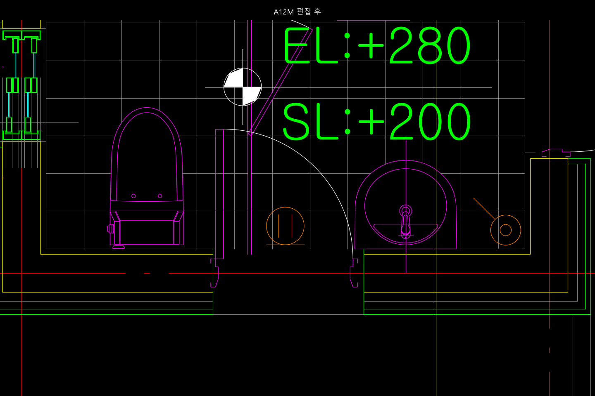 |

### 6단계. 맞게 반영됐는지 확인한다 (30초)

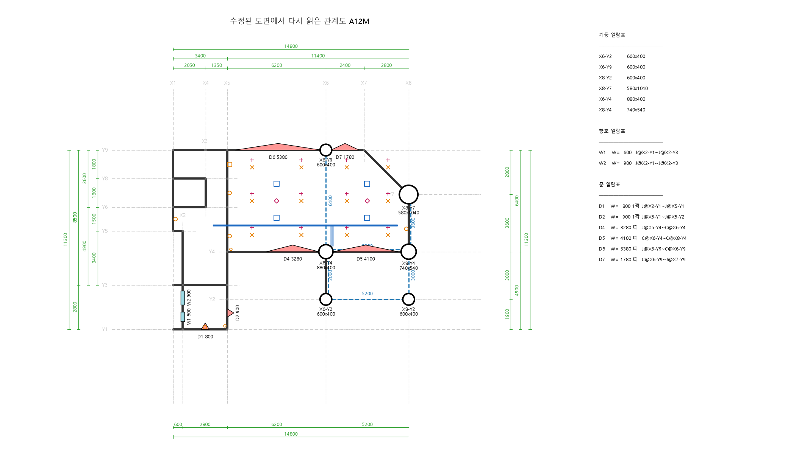

| 말할 것 | 근거 |
|---|---|
| "고친 도면을 처음처럼 다시 읽었습니다. 편집기에서 본 관계도와 같으면 제대로 반영된 것입니다." | 왕복 검증 |
| "스물여섯 항목을 대조했고 모두 일치합니다." | 기둥 8, 벽 2, 문·창호 6, 치수 4, 기구 4, 덕트 2 항목: 26/26 |
| "원본 도면은 바뀌지 않습니다. 복사본을 고칩니다." | `out/real/A12M_edited.dxf` |

AutoCAD로 보여 주려면 `3_수정된_도면_AutoCAD로_열기.bat`.

---

## 2부. 백지에서 새로 그린다 (5분)

**상황**: 새 프로젝트의 계획 초기. 대지만 정해져 있다.

탭 ③을 보여 준다. 아무것도 없는 화면이다.

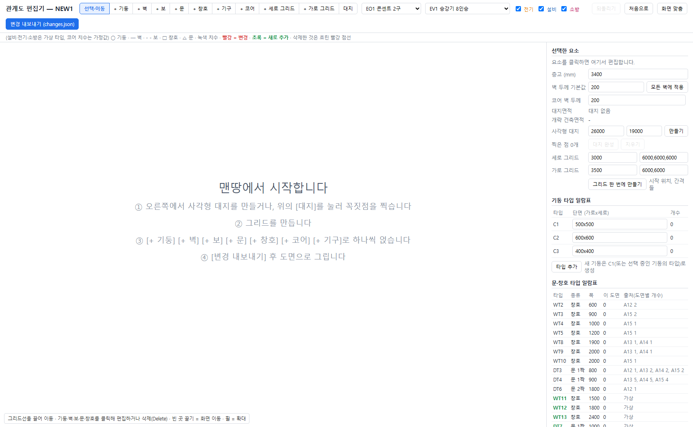

### 1단계. 대지와 그리드 (40초)

1. 오른쪽 "사각형 대지"에 `26000`, `19000`을 넣고 **만들기**.
2. "세로 그리드"에 시작 `3000`, 간격 `6000,6000,6000`. "가로 그리드"에 시작 `3500`, 간격 `6000,6000`. **그리드 한 번에 만들기**.

| 화면에서 일어나는 일 | 말할 것 |
|---|---|
| 대지면적 494 ㎡ 표시 | "대지는 사각형이 아니어도 됩니다. 꼭짓점을 찍어서 그릴 수 있습니다." |
| 그리드 7줄과 치수가 생김 | "치수는 그리드를 놓는 순간 자동으로 생깁니다." |

### 2단계. 기둥, 벽, 보 (1분)

1. **+ 기둥**을 누르고 교점을 클릭한다. 전부 12개.
2. **+ 보**를 누르고 기둥 사이 구간을 클릭한다.
3. **+ 벽**을 누르고 바깥 둘레 구간을 클릭한다.

시간을 아끼려면 몇 개만 직접 놓고 탭 ④로 넘어간다.

| 말할 것 | 근거 |
|---|---|
| "개략 건축면적 216 ㎡, 건폐율 약 44%가 바로 나옵니다." | 오른쪽 위 |
| "기둥과 기둥 사이의 보는 거더, 거더에 얹힌 보는 보로 자동으로 나뉩니다." | 보를 클릭하면 종류와 경간 표시 |

### 3단계. 문, 창호, 코어 (1분)

1. **+ 문**, **+ 창호**를 누르고 벽 위를 클릭한다.
2. 상단 목록에서 **EV1 승강기 8인승**을 고르고 **+ 코어**, 왼쪽 가운데 교점(X1-Y2)을 클릭한다.
   - 오른쪽에서 "입구 방향"을 **오른쪽**으로, "세울 벽"에서 **왼쪽**을 끈다(외벽이 대신함).
3. **ST1 꺾임 계단 폭 1200**을 고르고 **+ 코어**, 그 옆 교점(X2-Y2)을 클릭한다. "옆으로 뒤집기"를 눌러 승강기 쪽으로 놓는다.

| 화면에서 일어나는 일 | 말할 것 |
|---|---|
| 승강기는 입구만 뚫리고 나머지는 벽으로 둘러싸임 | "승강기는 크기 타입과 입구 방향만 정합니다." |
| 계단: 층고 3400 → 20단, 단높이 170, 길이 3720 | "계단은 올라가는 방향만 정하면 단수와 길이가 계산됩니다. 층고를 바꾸면 다시 계산됩니다." |
| 코어가 기둥 면에서 시작 | "코어는 기둥이나 벽 속으로 들어가지 않게 놓입니다." |

코어의 크기, 단높이 상한 180, 단너비 280은 가정값이라고 말한다.

여기까지 하면 아래와 같다(`5_새_프로젝트_예시_보기.bat`).

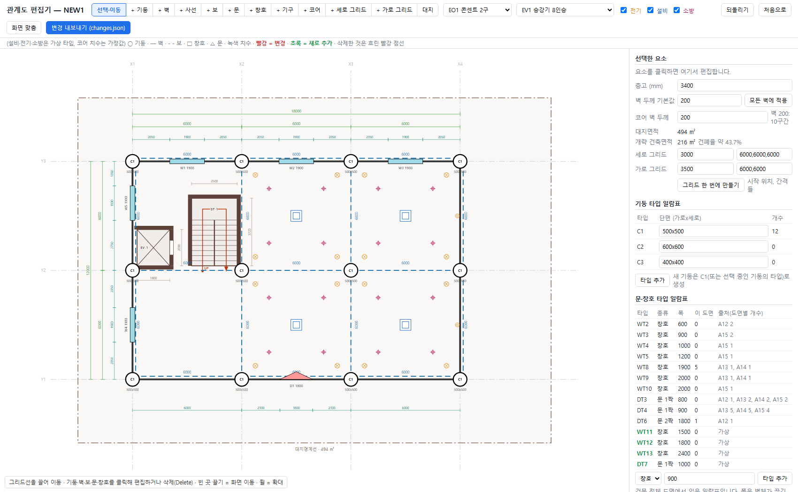

### 4단계. 벽 두께, 작은 보, 사선 모서리 (1분)

탭 ④로 넘어간다. 아래가 끝 상태다. 오른쪽 아래 모서리가 사선으로 잘려 있다.

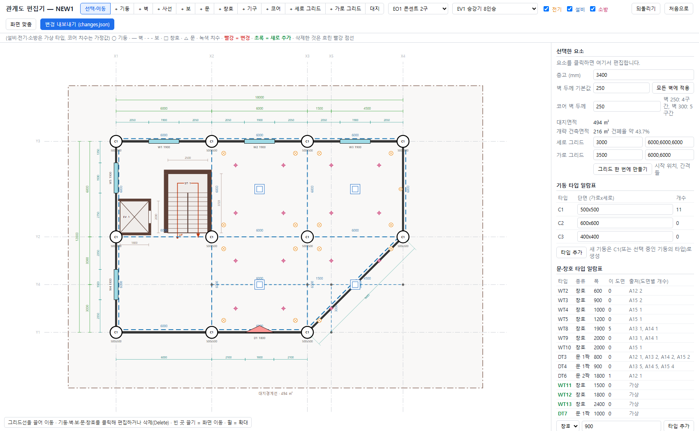

1. 위쪽 외벽을 클릭한다. "벽 두께" 300, "벽선 굵기" 0.50 mm가 보인다.
2. 옆 외벽을 클릭한다. 두께 250, 굵기 0.40 mm.
3. 아래쪽 가운데의 짧은 점선을 클릭한다. "보, 경간 1500, 점선 굵기 0.18 mm".
4. 오른쪽 아래의 사선 벽을 클릭한다. "사선 (교점과 교점을 이음) / 8485 mm", 보도 켜져 있어 "거더, 경간 8485".

사선 벽을 직접 만들어 보이려면: 상단 **+ 사선**을 누르고 교점 두 개를 차례로 클릭한다. 그리드는 건드리지 않는다.

| 말할 것 | 근거 |
|---|---|
| "벽 두께는 벽마다, 그리드 한 줄씩, 또는 전체에 한 번에 넣을 수 있습니다." | 벽을 클릭했을 때와 아무것도 선택하지 않았을 때의 오른쪽 칸 |
| "모서리를 자를 때 그리드를 새로 그을 필요가 없습니다. 교점 두 개를 이으면 사선 벽이 되고, 모서리 기둥은 빼면 됩니다." | 사선 벽 하나, 기둥 11개 |
| "모서리를 잘라 내면 그 밖에 남는 조명과 헤드를 경고로 알려 줍니다." | 이 예시에서는 2개를 지웠음 |
| "두꺼운 벽은 굵은 선, 긴 보는 굵은 점선으로 그려집니다." | 선 굵기 규칙 |

### 5단계. 도면으로 뽑는다 (1분)

1. **변경 내보내기**, 그리고 `2_도면에_반영.bat`.
2. `3_수정된_도면_AutoCAD로_열기.bat`으로 AutoCAD에서 연다.

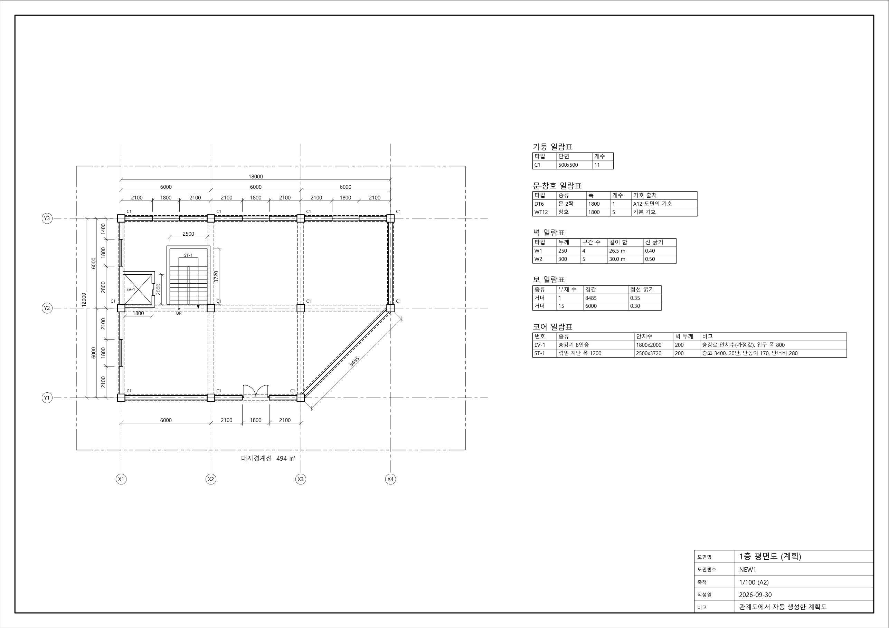

| 도면에 들어 있는 것 | 내용 |
|---|---|
| 치수 | 그리드 치수, 문·창호 위치 치수, 코어 치수 |
| 일람표 | 기둥, 문·창호, 벽, 보, 코어 다섯 개 |
| 도면 틀과 표제란 | A2, 1/100 |
| 레이어 | 역할별로 나뉘고 색·선 굵기·선종류가 지정됨 |

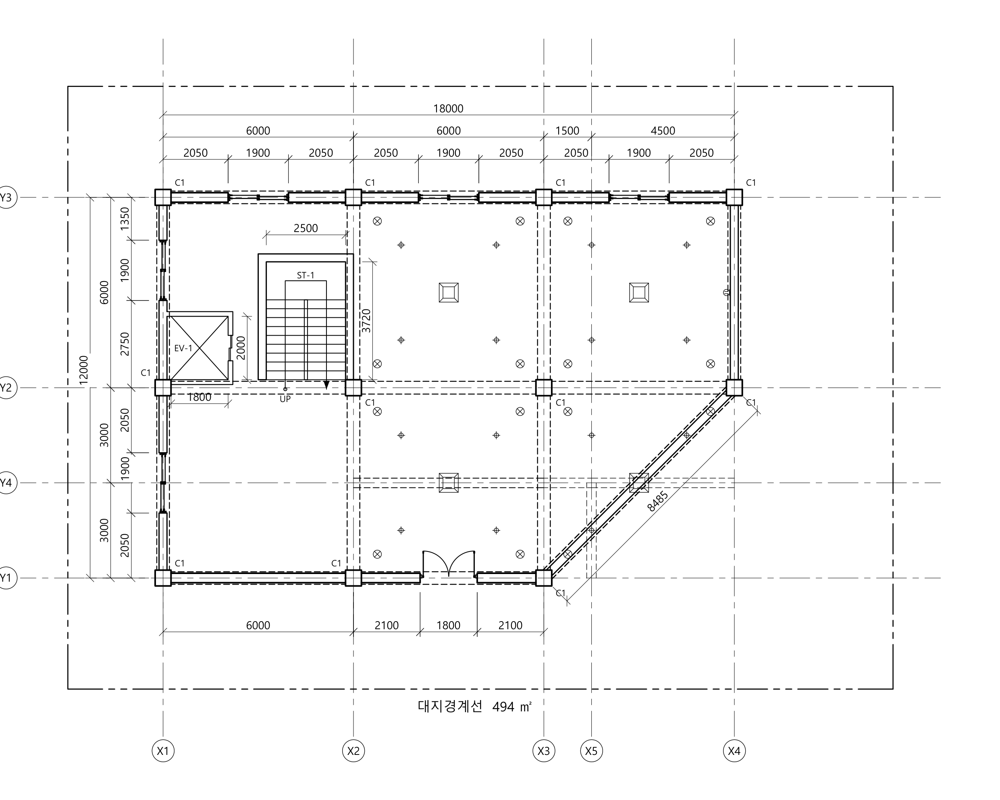

확대해서 보여 줄 곳 두 군데:

| 벽과 기둥이 만나는 곳 | 선 굵기 |
|---|---|
| 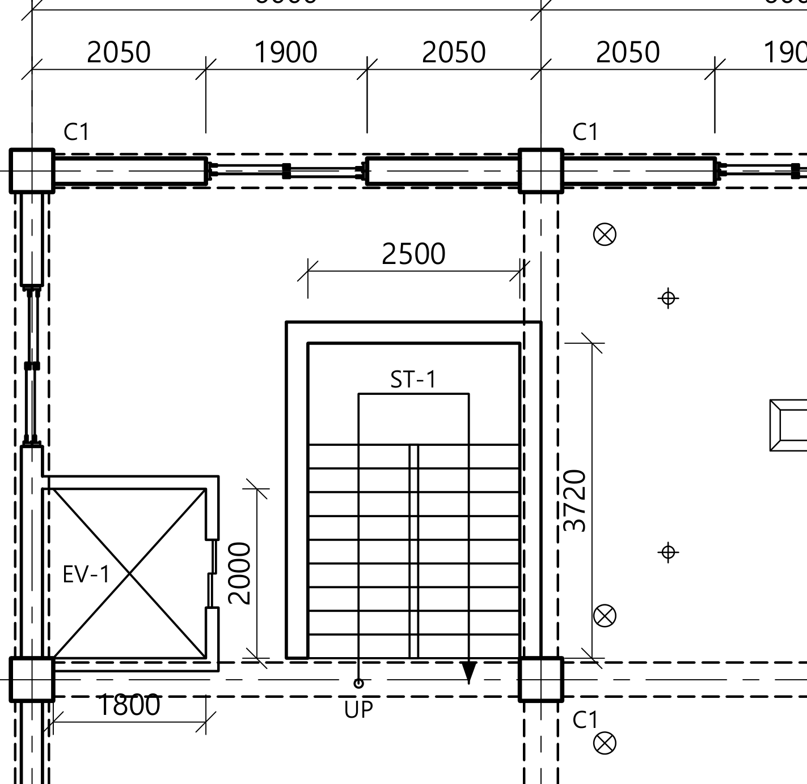 | 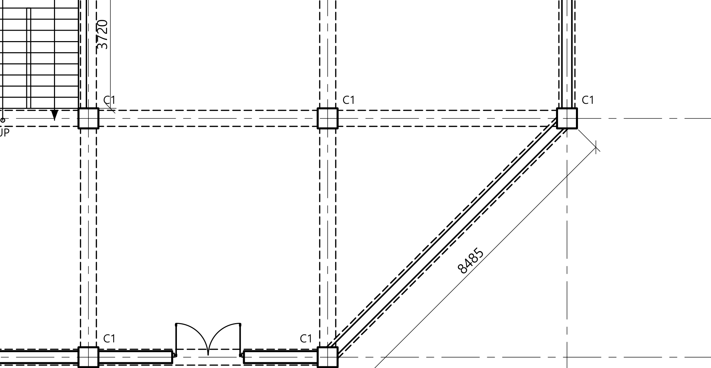 |
| 벽선이 기둥 면에서 멈추고, 승강로 벽이 외벽과 한 덩어리로 이어짐 | 거더(굵은 점선), 거더에 얹힌 보(중간), 짧은 보(가는 점선) |

사선 모서리:

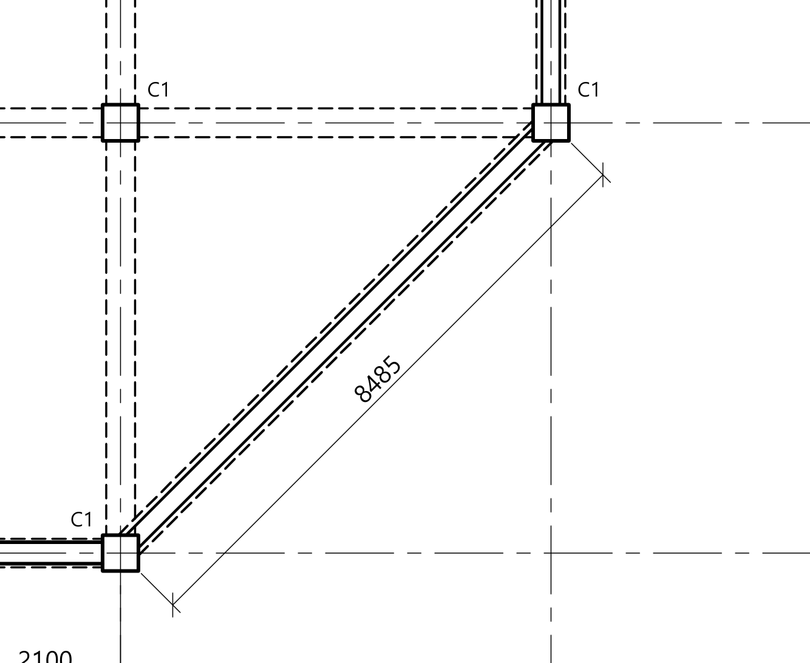

사선 벽이 양쪽 외벽과 모서리에서 맞물리고, 기둥 면에서 멈추고, 사선 길이 8485의 정렬 치수가 붙는다.

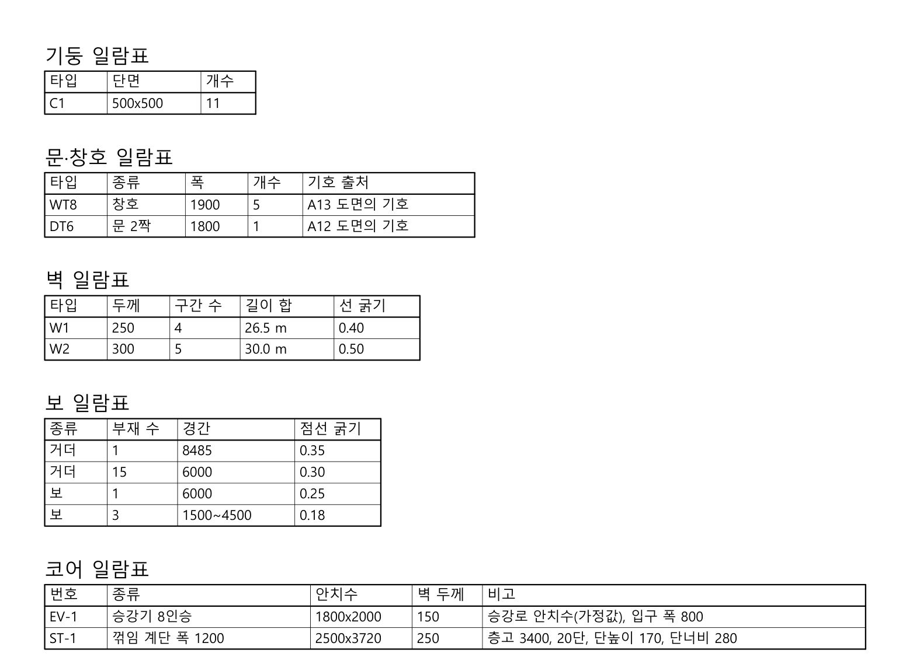

| 말할 것 | 근거 |
|---|---|
| "치수는 대지경계선 안쪽에 들어가도록 줄 간격을 스스로 줄였습니다." | 위쪽 1200, 1900, 2600. 왼쪽은 더 좁아 1000, 1650, 2300 |
| "글자가 선이나 다른 글자와 겹치면 빈 자리를 찾아 옮깁니다." | 반영 기록의 "겹침 피하기" |
| "AutoCAD의 도면 검사에서 오류가 없습니다." | AUDIT 0건 |
| "이 도면을 다시 읽으면 같은 관계도가 나옵니다. 벽 두께와 코어까지 그대로입니다." | 33/33 일치 |

### 마무리 (20초)

> "1부에서는 있는 도면을 관계도로 읽어서 고쳤고, 2부에서는 관계도를 먼저 그려서 도면을 뽑았습니다.
> 방향은 반대지만 가운데에 있는 것은 같은 관계도입니다. 그래서 새로 그린 도면도 나중에 1부처럼 고칠 수 있습니다."

---

## 조작이 막혔을 때

| 상황 | 대처 |
|---|---|
| 클릭한 자리가 맞지 않거나 순서를 놓침 | 상단 **되돌리기**. 그래도 안 되면 끝 상태 탭(②, ④)으로 넘어가 "결과는 이렇습니다"라고 말한다 |
| `2_도면에_반영.bat`이 "변경 파일을 찾지 못했습니다" | **변경 내보내기**를 먼저 눌렀는지 확인 |
| 반영이 오래 걸림 | 이 문서의 그림을 띄워 놓고 설명을 이어 간다 |
| AutoCAD가 안 열림 | 그림만으로 진행한다. AutoCAD 확인은 필수가 아니다 |
| 화면이 너무 작거나 치우침 | 상단 **화면 맞춤** |

## 예상 질문과 답

| 질문 | 답 |
|---|---|
| AI는 어디에 쓰입니까? | 이 시연에는 들어 있지 않습니다. 편집은 사람이 했습니다. 회의 녹음에서 변경 지시를 뽑는 부분은 팀의 다른 작업이고, 그 결과가 여기서 본 변경 파일과 같은 형식으로 들어오면 그대로 반영됩니다. |
| 아무 도면이나 읽을 수 있습니까? | 아닙니다. 이 도면 세트의 레이어 이름과 그리는 방식에 맞춰져 있습니다. 다른 사무소 도면은 레이어 이름을 맞추는 작업이 필요합니다. |
| 사선이나 곡선 벽은 됩니까? | 사선은 됩니다. 그리드 교점 두 개를 이으면 되고, 1부 도면의 사선 외벽도 읽습니다. 다만 사선 벽 위에 문·창호는 아직 못 놓습니다. 곡선은 안 됩니다. |
| 여러 층을 한꺼번에 고칠 수 있습니까? | 그리드 이동은 여러 도면에 전파됩니다. 요소를 추가하고 지우는 편집은 한 장에서만 됩니다. |
| 설비 도면도 읽습니까? | 아닙니다. 설비·전기·소방은 가상으로 배치한 것이고 기준값도 가정입니다. 실제 설비 도면을 읽는 것은 만들지 않았습니다. |
| 경고의 기준은 법규입니까? | 아닙니다. 시연용으로 정한 값입니다. |
| 새로 그린 도면을 바로 납품할 수 있습니까? | 아닙니다. 계획 초기의 도면입니다. 마감선, 단열재, 실 이름, 가구 같은 것은 없습니다. |
| 실제 도면을 공개해도 됩니까? | 건축주의 동의를 받았고, 설계사무소와 대지 위치를 알 수 있는 정보를 지운 복사본입니다. |

## 이 문서의 숫자를 다시 확인하는 방법

```text
cd prototype/relation-editor
bash tools/setup_from_drawings.sh
bash tools/check_all.sh
python propagate/apply_edits.py A12M out/editor/changes_demo.json out/editor/expected_demo.json
python tools/make_scenario_images.py
```

| 확인 | 결과 (2026-09-30) |
|---|---|
| 편집기 로직 시험 | 새 프로젝트 83개, 기존 도면 44개 통과 |
| 화면 조작 시험 (Edge에서 실제 클릭을 흉내) | 새 프로젝트 30개, 기존 도면 27개 통과 |
| 1부 끝 상태를 도면에 반영하고 다시 읽기 | 26/26 일치 |
| 2부 끝 상태를 도면으로 그리고 다시 읽기 | 31/31 일치 (사선 벽 포함) |
| AutoCAD 2024 | 2부 도면: 열림, 도면 검사 오류 0건, 출력 정상 |

1부와 2부의 끝 상태는 위 명령으로 매번 같은 결과가 나온다. 손으로 조작하는 단계는 같은 동작을 화면에서 하는 것이고, 화면 조작 시험이 그 동작들을 확인한다. 다만 **이 대본의 순서대로 사람이 처음부터 끝까지 손으로 조작해 본 기록은 없다.** 발표 전에 한 번 따라 해 보아야 한다.
