# 시연 시나리오: 관계도로 도면을 고치고, 관계도로 도면을 그린다

발표자(또는 영상 촬영자)가 그대로 따라 하면 되는 대본이다. 전체 10분, 두 부분으로 나뉜다.

| 부 | 내용 | 시간 | 보여 주는 것 |
|---|---|---|---|
| 1부 | 있는 도면을 고친다 | 5분 | 회의에서 나온 변경 지시를 관계도에서 처리하고, 실제 도면에 반영하고, 맞게 반영됐는지 확인 |
| 2부 | 백지에서 새로 그린다 | 5분 | 대지경계선만 있는 상태에서 관계도를 쌓아, 치수와 일람표까지 있는 도면을 뽑음 |
| 3부 (선택) | 회의 → PDF 지시 → 도면 | 2분 | 팀 플러그인이 회의 녹음에서 뽑아 낸 '설계 변경 지시 일람표' PDF를 그대로 읽어 도면과 관계도에 반영 |

**한 문장으로**: 도면의 선을 하나씩 고치는 대신 "기둥, 벽, 보, 문, 창호가 서로 어떻게 붙어 있는가"를 고치면, 선과 치수와 설비 위치는 따라온다.

**이 대본은 리허설을 거친 것이다.** 아래 단계는 `python tools/rehearse.py`가 브라우저(Edge)에서 실제 클릭·입력으로 순서대로 실행한 것과 같다. 2026-09-30 기준으로 1부 10단계, 2부 11단계, 3부 4단계가 모두 통과했고, 내보낸 변경을 도면에 반영해 다시 읽었을 때 1부 17/17, 2부 31/31, 3부 10/10 항목이 일치했다. 단계마다 찍힌 화면이 `scenario/rehearsal/`에 있다. 이 문서의 숫자는 모두 그 실행에서 나온 것이다.

---

## 시연 전 준비 (5분 전)

1. 한 번만: `pip install -r requirements.txt`, 그리고 `bash tools/setup_from_drawings.sh`
2. 아래 파일 네 개를 미리 더블클릭해서 브라우저 탭으로 열어 둔다. 창 크기는 가로 1700 이상이 좋다(오른쪽 칸이 접히지 않는다).

| 탭 | 파일 | 쓰는 곳 |
|---|---|---|
| ① | `1_편집기_열기.bat` | 1부를 직접 조작 |
| ② | `0_예시_편집_상태로_열기.bat` | 1부의 끝 상태 (조작이 막히면 이 탭으로) |
| ③ | `4_새_프로젝트_시작.bat` | 2부를 직접 조작 |
| ④ | `6_시나리오_새_프로젝트_끝_상태_보기.bat` | 2부의 끝 상태 (조작이 막히면 이 탭으로) |
| ⑤ | `1_편집기_열기.bat` 한 번 더 | 3부 (1부와 다른 탭에서 시작해야 깨끗하다) |

3부를 할 거면 `7_지시_PDF로_도면_고치기.bat`을 미리 한 번 돌려 둔다. 편집기에서 불러올 JSON 두 개(`out/real/instructions_*.json`)가 만들어진다. 그리고 `samples/instructions/pdf-test.dxf-변경일람-20260930-190327.pdf`를 PDF 뷰어로 열어 둔다.

3. 브라우저의 다운로드 폴더에 예전 `changes_*.json`이 있으면 지운다. `2_도면에_반영.bat`은 가장 최근 파일을 쓴다.
4. AutoCAD까지 보여 줄 거면 AutoCAD를 미리 켜 둔다. 켜는 데 시간이 걸린다.
5. 탭 ①에서 상단의 **전기·설비·소방** 체크 세 개를 **꺼 둔다.** (기본은 켜짐. 1부 3단계에서 켠다.)
6. 영상으로 찍을 거면: 탭 ①과 ③에서 각각 한 번씩 이 대본대로 끝까지 해 보고, **처음으로**를 눌러 되돌린 뒤 녹화를 시작한다.

---

## 1부. 있는 도면을 고친다 (5분)

**상황**: 근린생활시설 1층 평면도. 설계 변경 회의에서 지시가 여섯 건 나왔다.

> ① 상가 전면 기둥열(X6)을 500 옮긴다 ② 화장실 창을 큰 것으로 바꾼다 ③ 화장실 문을 900으로 바꾼다
> ④ 위쪽 벽의 문 하나를 없앤다 ⑤ 상가 안에 벽을 세우고 문을 낸다 ⑥ 모서리 기둥 하나를 없앨 수 있는지 본다

### 0단계. 도면이 관계도로 읽힌다 (30초)

탭 ①을 보여 준다. 아무것도 선택하지 않은 상태.

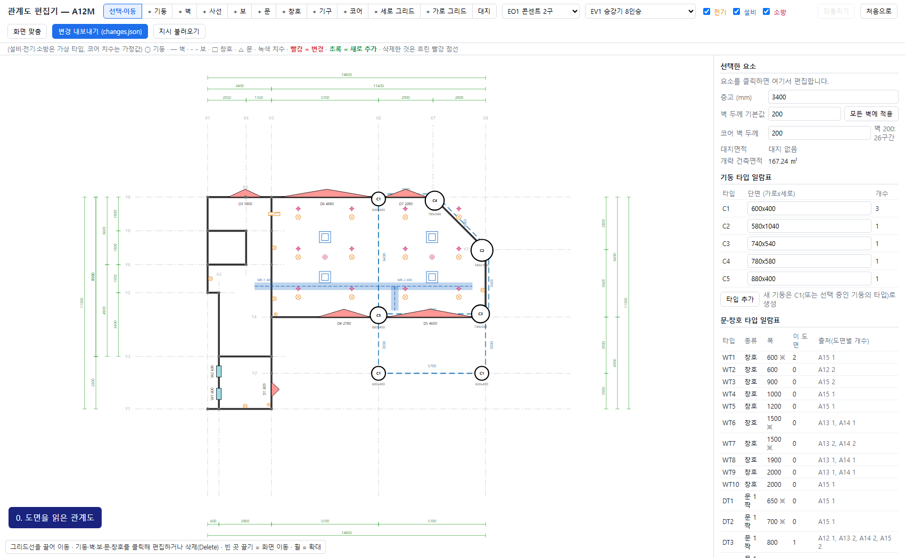

| 말할 것 | 근거 |
|---|---|
| "이 화면은 캐드 도면을 읽어서 만든 관계도입니다. 사람이 다시 그린 것이 아닙니다." | 그리드 17개, 기둥 7개(교점 26개), 구간 30개, 문·창호 8개, 치수 34개를 도면에서 읽음 |
| "동그라미는 기둥, 실선은 벽, 점선은 보, 네모는 창호, 세모는 문입니다." | 화면 위쪽의 범례 |
| "오른쪽 위의 사선 외벽도 그대로 읽혔습니다." | 그리드 교점 X7-Y9와 X8-Y7을 잇는 사선 구간 |
| "오른쪽 일람표는 1층부터 4층까지 도면 네 장에서 읽은 것입니다." | 창호 10종, 문 6종. 출처 칸에 도면 번호와 개수 |

### 1단계. 기둥열을 옮긴다 (1분) — 지시 ①

1. 세로 그리드선 **X6**(빨간 일점쇄선)을 클릭한다. 오른쪽에 "그리드 X6 (세로선, 좌우 이동)"이 뜬다.
2. **이동량 (mm)**에 `500`을 넣고 **적용**.

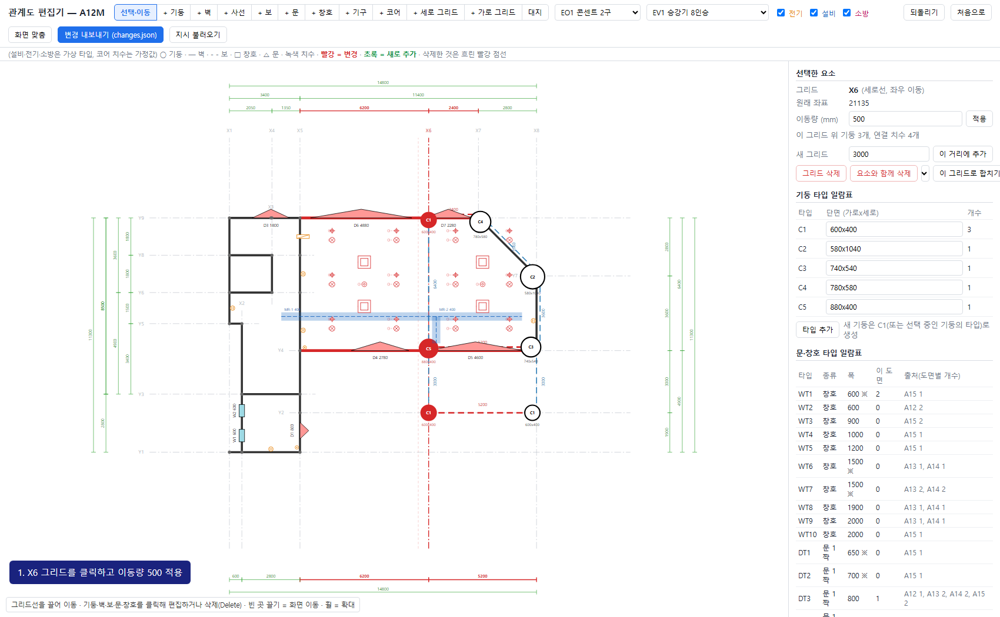

| 화면에서 일어나는 일 | 말할 것 |
|---|---|
| X6 위의 기둥 3개가 같이 움직임 | "기둥은 그리드에 붙어 있어서 그리드를 옮기면 따라옵니다." |
| 위아래 치수가 빨갛게 바뀜: 5700 → 6200, 2900 → 2400, 5700 → 5200 | "치수는 사람이 고치지 않았습니다. 전체 치수 14800은 그대로입니다." |
| 오른쪽 "경고"에 "벽 순길이 4390 mm보다 개구부 합계 4600 mm가 큼 (D5)" | "기둥열을 옮겼더니 상가 전면 문 D5가 좁아진 벽에 안 들어갑니다. 이런 것을 바로 알려 줍니다. 문을 줄일지 다른 기둥을 옮길지는 사람이 정합니다." |

### 2단계. 창과 문을 바꾼다 (1분) — 지시 ②③④

1. 왼쪽 아래 화장실 벽의 네모 **W2**를 클릭하고 **타입**에서 **WT3 · 폭 900**을 고른다.
2. 세모 **D1**을 클릭하고 **타입**에서 **DT4 · 폭 900**을 고른다.
3. 위쪽 벽 왼편의 세모 **D3**을 클릭하고 **삭제**(또는 Delete 키).

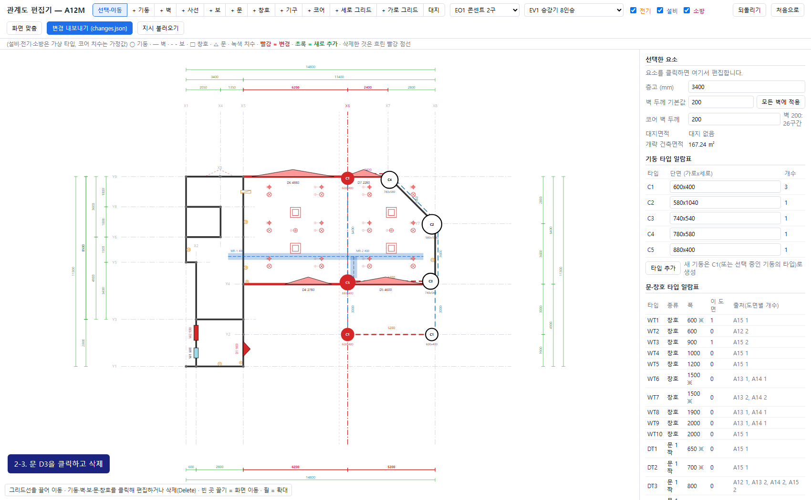

| 말할 것 | 근거 |
|---|---|
| "창을 늘린 것이 아니라, 일람표에 있는 더 큰 창으로 바꿨습니다. 실무에서 창호는 규격품이라 이렇게 합니다." | 타입 교체 방식 |
| "WT3은 1층에는 없는 창입니다. 4층 도면에 그려진 것을 가져옵니다." | 출처 칸의 A15 |
| "지운 문 자리는 벽으로 다시 이어집니다." | 도면 반영 때 벽선 6쌍 이음 |

### 3단계. 설비를 켜고, 벽을 세우고, 문을 낸다 (1분) — 지시 ⑤

1. 상단의 **전기, 설비, 소방** 체크를 켠다. 조명, 디퓨저, 스프링클러 헤드, 콘센트, 덕트가 나타난다.
2. **+ 벽**을 누른다. 초록 띠(놓을 수 있는 구간)가 뜬다. X6 위의 **Y2~Y4** 구간을 클릭한다.
3. **+ 문**을 누르고 맨 아래쪽 벽(Y1)에서 콘센트(주황 표시)가 있는 자리를 클릭한다.

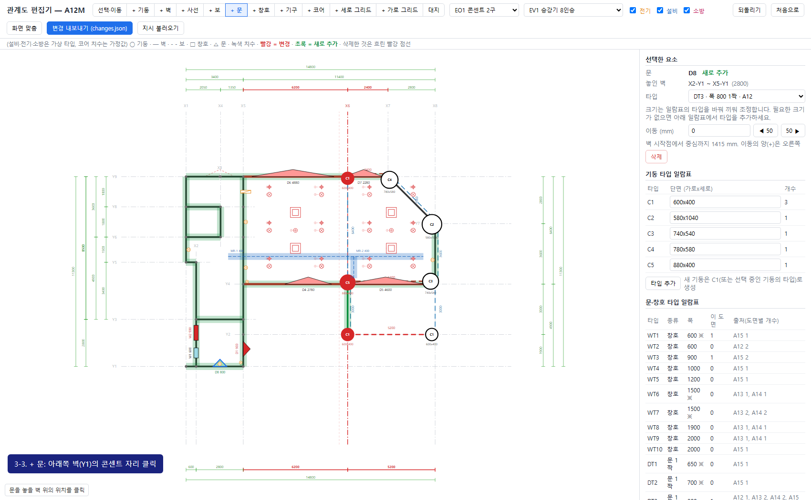

| 화면에서 일어나는 일 | 말할 것 |
|---|---|
| 조명·헤드·디퓨저가 1단계에서 넓어진 구획에 맞춰 이미 옮겨져 있음 | "기구는 '이 구획의 몇 퍼센트 위치'로 붙어 있어서 구획이 바뀌면 다시 놓입니다." |
| 경고: "EO-4 콘센트 2구: 문 D8(폭 800)와 겹침" | "문을 낸 자리에 콘센트가 있었습니다. 건축이 바꾸면 전기가 영향을 받는다는 것을 바로 알려 줍니다." |
| 경고: "MR-2 덕트: 기둥 X6-Y4과 간섭(겹침 50 mm)" | "기둥을 옮겼더니 덕트와 부딪혔습니다." |
| 경고: "헤드 FS-1~FS-4 가로 간격 3100 mm, 기준 3000 mm 초과" (3건) | "구획이 넓어져서 스프링클러 헤드가 모자랍니다." |

설비·전기·소방 기구는 이 도면 세트에 없어서 **시연용으로 가상 배치한 것**이라고 반드시 말한다. 기준값(헤드 간격 3000, 덕트 이격 100)도 가정값이다.

### 4단계. 기둥을 없애 본다 (30초) — 지시 ⑥

1. 상단 **선택·이동**으로 돌아온다. 위쪽 벽의 오른쪽 기둥 **X7-Y9**(C4)를 클릭하고 **기둥 삭제**.

| 화면에서 일어나는 일 | 말할 것 |
|---|---|
| 기둥이 흐린 빨강 점선으로 남음. 경고: "보의 지지 기둥 X7-Y9이 삭제됨. 구조 검토" | "없앨 수는 있지만, 이 기둥이 받치던 보가 있다고 알려 줍니다. 판단은 사람이 합니다." |

### 5단계. 실제 도면에 반영한다 (1분)

여기까지의 화면. 빨강은 바뀐 것, 초록은 새로 넣은 것, 흐린 빨강 점선은 지운 것이다. 오른쪽 "변경 내역"에 8건, "경고"에 10건.

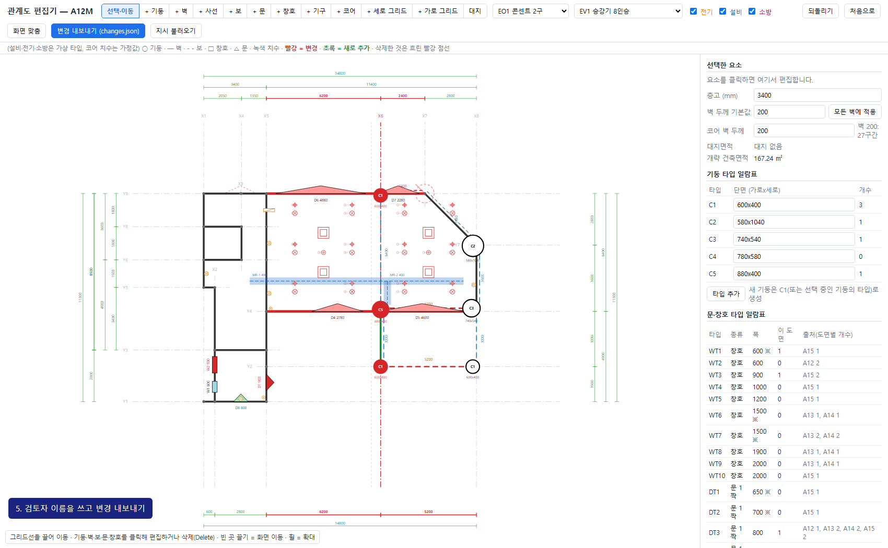

1. 오른쪽 맨 아래 **검토자**에 이름을 쓰고, 상단 **변경 내보내기 (changes.json)**을 누른다. `changes_A12M.json`이 내려받아진다.
2. `2_도면에_반영.bat`을 더블클릭한다. 20초쯤 걸린다. 기다리는 동안 아래 표를 말한다.

| 변경 | 도면에서 실제로 한 일 (반영 기록 그대로) |
|---|---|
| X6을 500 이동 | 객체 57개 이동. 치수 5700→6200, 2900→2400, 5700→5200이 함께 바뀜 |
| 창 W2를 WT3(900)으로 | 4층 도면(A15) 창 W5의 기호 36개를 복사해 90도 돌려 놓고, 문틀 쪽 벽선 16개를 옮김 |
| 문 D1을 DT4(900)로 | 2층 도면(A13) 문 D2의 기호 4개를 복사, 벽선 16개를 옮김 |
| 문 D3 삭제 | 객체 38개 삭제, 끊겼던 벽선 6쌍을 이음, 문틀선 8개 제거 |
| 벽 추가 X6-Y2~X6-Y4 | 두께 200, 길이 3000 |
| 문 D8 추가 | 벽선 6개를 잘라 1층 문 D1의 기호를 복사해 놓음 |
| 기둥 X7-Y9 삭제 | 기둥 1개 삭제 |
| 기구 | 30개 재배치(모두 건축 변경에 따른 자동 재배치) |

3. 그림 세 장이 열린다. 변경 전, 변경 후, 그리고 **수정된 도면에서 다시 읽은 관계도**.

| 변경 전 | 변경 후 |
|---|---|
|  |  |

창을 바꾼 자리를 확대한 것:

| 변경 전 | 변경 후 |
|---|---|
|  |  |

문을 새로 낸 자리를 확대한 것:

| 변경 전 | 변경 후 |
|---|---|
|  |  |

### 6단계. 맞게 반영됐는지 확인한다 (30초)


| 말할 것 | 근거 |
|---|---|
| "고친 도면을 처음처럼 다시 읽었습니다. 편집기에서 본 관계도와 같으면 제대로 반영된 것입니다." | 왕복 검증 |
| "열일곱 항목을 대조했고 모두 일치합니다." | 기둥 7(지운 것 1 포함), 벽 1, 문·창호 4, 치수 4, 기구 1: 17/17 |
| "원본 도면은 바뀌지 않습니다. 복사본을 고칩니다." | `out/real/A12M_edited.dxf` |

AutoCAD로 보여 주려면 `3_수정된_도면_AutoCAD로_열기.bat`.

---

## 2부. 백지에서 새로 그린다 (5분)

**상황**: 새 프로젝트의 계획 초기. 대지만 정해져 있다.

탭 ③을 보여 준다. 아무것도 없는 화면이다.

### 1단계. 대지와 그리드 (40초)

1. 오른쪽 **사각형 대지**에 `26000`, `19000`을 넣고 **만들기**.
2. **세로 그리드**에 시작 `3000`, 간격 `6000,6000,6000`. **가로 그리드**에 시작 `3500`, 간격 `6000,6000`. **그리드 한 번에 만들기**.

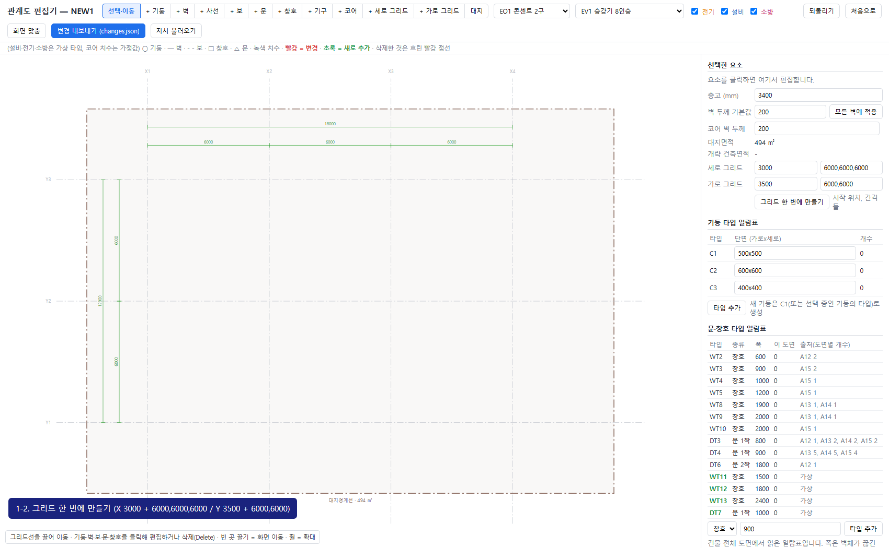

| 화면에서 일어나는 일 | 말할 것 |
|---|---|
| 대지면적 494 ㎡ 표시 | "대지는 사각형이 아니어도 됩니다. 꼭짓점을 찍어서 그릴 수 있습니다." |
| 그리드 7줄과 치수가 생김 | "치수는 그리드를 놓는 순간 자동으로 생깁니다. 대지경계선 안에 들어가도록 줄 간격을 스스로 정합니다." |

### 2단계. 기둥, 보, 벽 (1분 20초)

1. **+ 기둥**을 누르고 교점을 차례로 클릭한다. 전부 **12개**.
2. **+ 보**를 누르고 기둥 사이 구간(초록 띠)을 클릭한다. 전부 **17구간**.
3. **+ 벽**을 누르고 바깥 둘레 구간을 클릭한다. 전부 **10구간** (위 3, 아래 3, 왼쪽 2, 오른쪽 2).

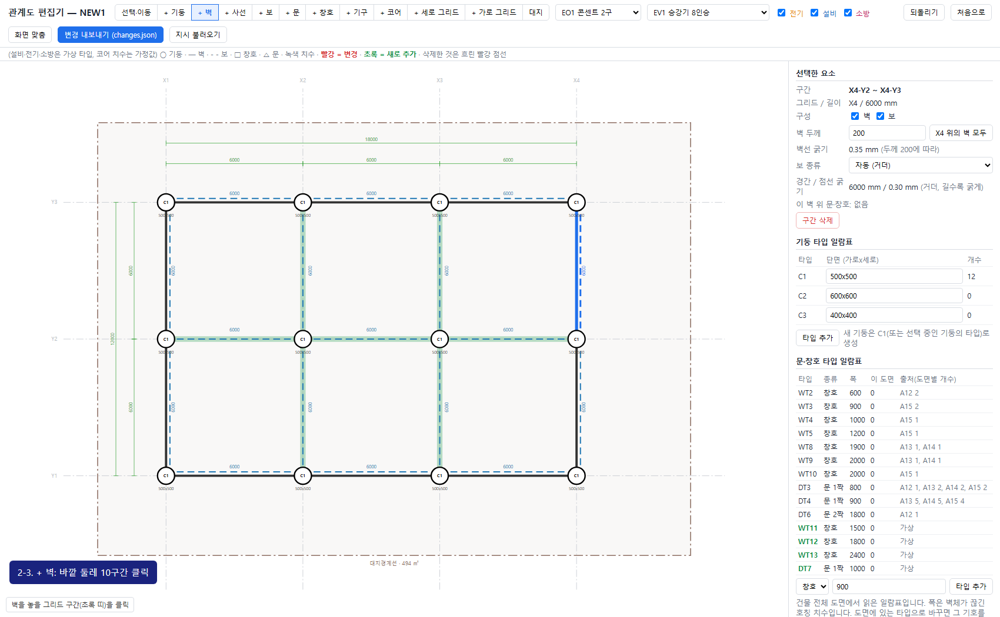

| 말할 것 | 근거 |
|---|---|
| "개략 건축면적 216 ㎡, 건폐율 약 43.7%가 바로 나옵니다." | 오른쪽 위 |
| "기둥과 기둥 사이의 보는 거더, 거더에 얹힌 보는 보로 자동으로 나뉩니다." | 보를 클릭하면 종류와 경간 표시 |

시간이 모자라면 기둥 몇 개만 직접 놓고 탭 ④로 넘어간다.

### 3단계. 문, 창호, 코어 (1분 20초)

1. **+ 문**을 누르고 아래 벽 X2~X3의 가운데를 클릭한다. 오른쪽 **타입**에서 **DT6 · 폭 1800 2짝**을 고른다.
2. **+ 창호**를 누르고 위 벽 세 구간의 가운데와 왼쪽 벽 두 구간을 클릭한다. 하나 놓을 때마다 오른쪽 **타입**에서 **WT12 · 폭 1800**을 고른다. (놓는 순간에는 기본 타입으로 들어가고, 타입을 고르면 바뀐다.)
3. 상단 목록에서 **EV1 승강기 8인승**을 고르고 **+ 코어**, 왼쪽 가운데 교점 **X1-Y2**를 클릭한다.
   - 오른쪽에서 **입구 방향**을 **오른쪽**으로, **세울 벽**에서 **왼쪽**을 끈다. "(건물 벽이 대신함)"이라고 표시된다.
4. **ST1 꺾임 계단 폭 1200**을 고르고 **+ 코어**, 그 옆 교점 **X2-Y2**를 클릭한다. **옆으로 뒤집기**를 눌러 승강기 쪽으로 놓는다.

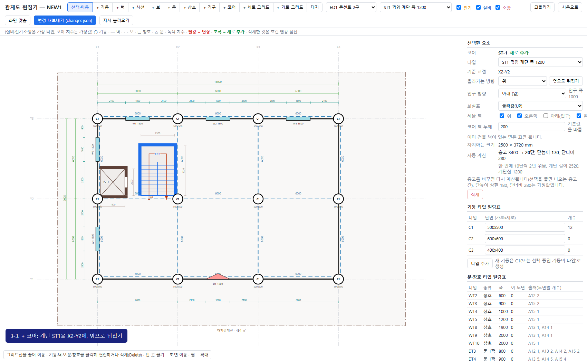

| 화면에서 일어나는 일 | 말할 것 |
|---|---|
| 승강기는 입구만 뚫리고 나머지는 벽으로 둘러싸임 | "승강기는 크기 타입과 입구 방향만 정합니다." |
| 계단: 층고 3400 → 20단, 단높이 170, 단너비 280, 길이 3720, UP 화살표 | "계단은 올라가는 방향만 정하면 단수와 길이가 계산됩니다. 층고를 바꾸면 다시 계산됩니다." |
| 코어가 기둥 면에서 시작 | "코어는 기둥이나 벽 속으로 들어가지 않게 놓입니다." |

코어의 크기, 단높이 상한 180, 단너비 280은 가정값이라고 말한다.

### 4단계. 벽 두께, 사선 모서리 (1분)

1. 빈 곳을 클릭해 선택을 푼다. 오른쪽 **벽 두께 기본값**에 `250`을 넣고 **모든 벽에 적용**.
2. 위쪽 외벽 하나를 클릭한다. **벽 두께**에 `300`을 넣고 **Y3 위의 벽 모두**. 아래쪽 외벽도 같이: 클릭 → `300` → **Y1 위의 벽 모두**.
3. 오른쪽 아래 모서리를 자른다. 모서리 기둥 X4-Y1에 붙은 **아래 벽 X3~X4**를 클릭하고 **구간 삭제**, **오른쪽 벽 Y1~Y2**를 클릭하고 **구간 삭제**, 모서리 **기둥 X4-Y1**을 클릭하고 **기둥 삭제**.
4. 상단 **+ 사선**을 누르고 교점 **X3-Y1**, **X4-Y2**를 차례로 클릭한다. 오른쪽에서 **보** 체크를 켠다.

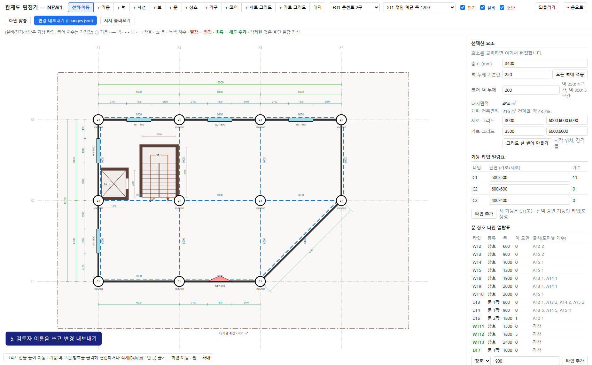

| 말할 것 | 근거 |
|---|---|
| "벽 두께는 벽마다, 그리드 한 줄씩, 또는 전체에 한 번에 넣을 수 있습니다." | 오른쪽에 "벽 250: 4구간, 벽 300: 5구간" |
| "모서리를 자를 때 그리드를 새로 그을 필요가 없습니다. 교점 두 개를 이으면 사선 벽이 되고, 모서리 기둥은 빼면 됩니다." | 사선 벽 하나, 기둥 11개, 사선 길이 8485의 정렬 치수 |
| "두꺼운 벽은 굵은 선으로, 긴 보는 굵은 점선으로 그려집니다." | 사선 거더를 클릭하면 경간 8485, 점선 굵기 0.35 mm (다른 거더는 0.30) |
| 경고: "새 보 스팬 8485 mm, 기준 7500 초과" | "긴 보는 구조 검토가 필요하다고 알려 줍니다." |

### 5단계. 도면으로 뽑는다 (1분)

1. **검토자**에 이름을 쓰고 **변경 내보내기 (changes.json)**, 그리고 `2_도면에_반영.bat`. 10초쯤 걸린다.
2. `3_수정된_도면_AutoCAD로_열기.bat`으로 AutoCAD에서 연다.

| 도면에 들어 있는 것 | 반영 기록 그대로 |
|---|---|
| 대지경계선, 그리드 7줄 | 494 ㎡ |
| 기둥 11개, 벽 9구간 + 사선 1, 거더 16 + 사선 거더 1 | 벽 16구간(코어 벽 포함)을 면으로 합쳐 외곽선 36개로 그림. 기둥 11개의 면에서 벽선을 끊고, 벽끼리 만나는 모서리 5곳을 채움 |
| 문 1, 창호 5 | 문은 1층 도면의 두 짝 문 기호(38개)를 복사. 창호는 기본 기호 |
| 코어 2 | 승강기 1800x2000 입구 오른쪽, 벽 외곽선 10개(건물 벽과 이어 그림). 계단 20단, 벽 외곽선 7개 |
| 치수 31개 | 그리드 7, 문·창호 위치 19, 코어 4, 사선 1 (치수 스타일 HIMEC-100) |
| 일람표 5개 | 기둥, 문·창호, 벽, 보, 코어 |
| 글자 겹침 | 글자 14개 가운데 4개를 빈 자리로 옮김. 치수 글자 12000을 그리드선을 피해 550 옆으로 |


확대해서 보여 줄 곳:

| 벽과 기둥이 만나는 곳 | 사선 모서리 |
|---|---|
|  |  |
| 벽선이 기둥 면에서 멈추고, 승강로 벽이 외벽과 한 덩어리로 이어짐 | 사선 벽이 양쪽 외벽과 모서리에서 맞물리고, 사선 길이 8485의 정렬 치수가 붙음 |


| 말할 것 | 근거 |
|---|---|
| "치수는 대지경계선 안쪽에 들어가도록 줄 간격을 스스로 줄였습니다." | 편집기 화면의 위쪽·왼쪽 치수 줄 |
| "글자가 선이나 다른 글자와 겹치면 빈 자리를 찾아 옮깁니다." | 반영 기록의 "겹침 피하기" |
| "이 도면을 다시 읽으면 같은 관계도가 나옵니다. 벽 두께와 코어까지 그대로입니다." | 31/31 일치 |
| "AutoCAD에서 열어 도면 검사를 하면 오류가 없습니다." | 아래 "확인 결과" 표 |

거더와 그에 얹힌 보의 점선 굵기 차이까지 보이려면 탭 ④(짧은 보가 있는 예시)에서 아래쪽 가운데 짧은 점선을 클릭한다: "보, 경간 1500, 점선 굵기 0.18 mm".

---

## 3부 (선택). 회의에서 나온 지시가 PDF로 오면 (2분)

**상황**: 팀 플러그인이 회의 녹음에서 변경 지시를 뽑아 AutoCAD에서 '설계 변경 지시 일람표' PDF로 냈다. 표에는 번호·대상·변경·층·상태가 있고, 대상에는 플러그인이 도면에서 고른 객체의 핸들(`C1 #8E`)이 붙어 있다.

### 1단계. PDF를 보여 준다 (20초)

열어 둔 PDF. 표 두 줄: `[1] C1 #8E · Y +300 mm · 대상 확정`, `[2] 기둥 · Y -200 mm · 3층? · 확인 필요`. 도면 위 COLUMN 1에 ① 풍선이 붙어 있다.

| 말할 것 | 근거 |
|---|---|
| "회의 녹음에서 나온 지시가 이런 표로 옵니다. 사람이 승인한 것만 '확정'이고, 대상이 애매한 것은 '확인 필요'로 남습니다." | 상태 칸 |
| "`#8E`는 플러그인이 도면에서 고른 그 객체의 번호입니다. 이름이 같은 기둥이 여러 개여도 헷갈리지 않습니다." | 대상 칸 |

### 2단계. PDF로 도면을 바로 고친다 (40초)

`7_지시_PDF로_도면_고치기.bat`을 더블클릭한다. 몇 초 뒤 전후 비교 그림이 열린다.

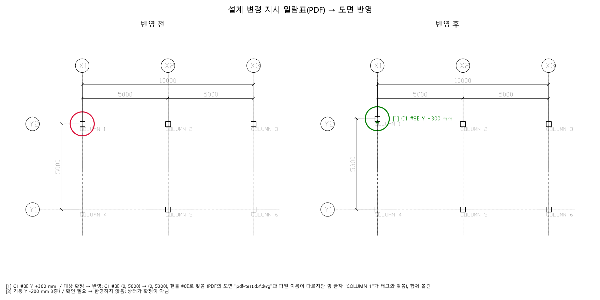

| 화면에서 일어나는 일 | 말할 것 |
|---|---|
| 명령창: `[1] … → 반영: C1 #8E (0, 5000) → (0, 5300), 핸들 #8E로 찾음, 함께 옮긴 객체 5개` | "확정된 [1]만 반영했습니다. 핸들로 찾았으니 대상이 틀릴 수 없습니다." |
| `[2] … → 반영하지 않음: 상태가 확정이 아님` | "확인 필요인 것은 건드리지 않습니다." |
| 그림: 왼쪽 위 기둥이 300 올라가고, 기둥 이름과 세로 치수(5000 → 5300)가 따라감 | "기둥에 붙은 글자와 치수도 같이 갑니다." |

이 도면은 PDF 그림과 같은 6기둥 **시험 도면**(`tools/make_pdf_test_dxf.py`가 만든 것)이라고 말한다. PDF를 낸 도면 파일 자체는 우리에게 없다.

### 3단계. 같은 PDF를 관계도 편집기에 올린다 (1분)

탭 ⑤(깨끗한 1층 편집기)에서:

1. 상단 **지시 불러오기** → `out/real/instructions_pdf-test.dxf-변경일람-20260930-190327.json`을 고른다. 오른쪽 "변경 지시" 칸으로 화면이 내려간다.
2. `[1]`에 "C1 타입 기둥이 3개라 하나로 정할 수 없음 (핸들 #8E은 이 도면에 없음)"이라고 뜬다. 가운데 아래 기둥 **X6-Y2**를 클릭하고 `[1]`의 **고른 줄에 적용**을 누른다.
   - Y2 그리드가 +300 되고 기둥 두 개가 따라간다. 오른쪽 치수 3000 → 2700, 1900 → 2200.
3. **되돌리기**를 두 번 누른다. 이번에는 **지시 불러오기** → `out/real/instructions_A12M_handle_demo.json`을 고른다.
   - `[1]`이 바로 "적용됨 · Y2 그리드 11854 → 12154 (+300), 기둥 X6-Y2이 놓인 줄"로 뜬다.

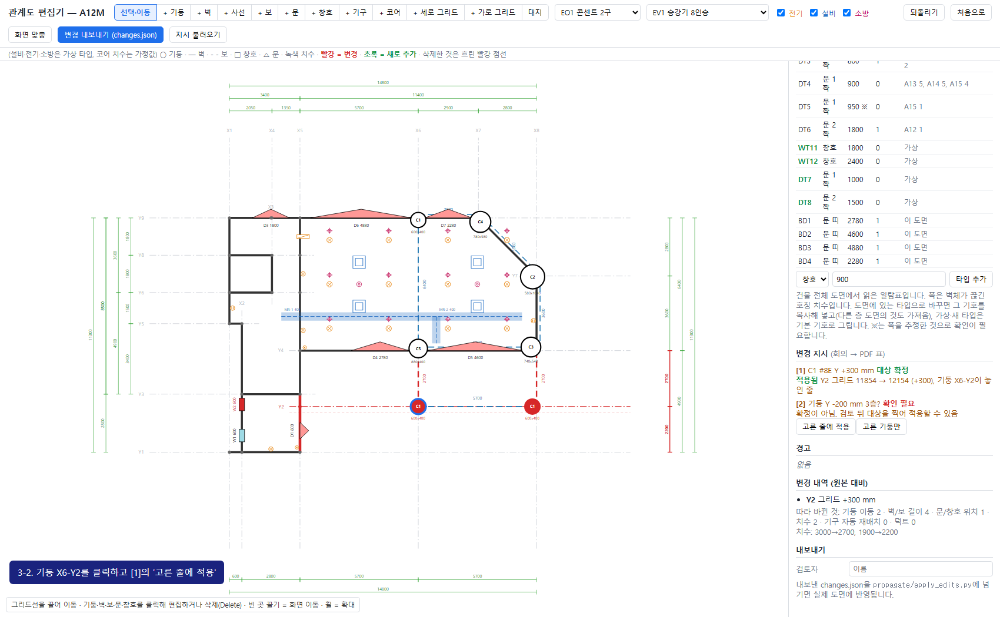

| 말할 것 | 근거 |
|---|---|
| "이 PDF는 다른 도면에서 낸 것이라 핸들 #8E가 이 도면에 없습니다. 그러면 사람에게 대상을 찍으라고 합니다. 태그 C1만으로는 기둥이 세 개라 정하지 않습니다." | 2번 |
| "플러그인이 이 도면에서 냈다면 핸들이 맞아서 바로 적용됩니다. 그 경우를 같은 형식으로 만든 파일로 보였습니다." | 3번. `instructions_A12M_handle_demo.json`은 시험용이라고 반드시 말한다 |
| "그 다음은 1부와 같습니다. 경고를 보고, 변경 내보내기, 도면에 반영." | 변경 내역에 "Y2 그리드 +300 mm", 다시 읽어 10/10 일치 |

### 마무리 (20초)

> "1부에서는 있는 도면을 관계도로 읽어서 고쳤고, 2부에서는 관계도를 먼저 그려서 도면을 뽑았습니다.
> 방향은 반대지만 가운데에 있는 것은 같은 관계도입니다. 그래서 새로 그린 도면도 나중에 1부처럼 고칠 수 있습니다."

---

## 조작이 막혔을 때

| 상황 | 대처 |
|---|---|
| 클릭한 자리가 맞지 않거나 순서를 놓침 | 상단 **되돌리기**. 그래도 안 되면 끝 상태 탭(②, ④)으로 넘어가 "결과는 이렇습니다"라고 말한다 |
| 초록 띠(후보)가 안 보임 | 지금 켜진 도구가 맞는지 상단을 본다. **+ 벽**·**+ 보**는 기둥이 있는 교점 사이에만 후보가 뜬다 |
| 문·창호가 엉뚱한 타입으로 들어감 | 놓은 직후 오른쪽 **타입**에서 고른다. 크기는 타입으로 바꾼다 |
| 코어가 원하는 쪽에 안 놓임 | 코어를 클릭하고 **옆으로 뒤집기**, **입구 방향**, **세울 벽**을 바꾼다 |
| `2_도면에_반영.bat`이 "변경 파일을 찾지 못했습니다" | **변경 내보내기**를 먼저 눌렀는지 확인 |
| 반영이 오래 걸림 | 이 문서의 그림을 띄워 놓고 설명을 이어 간다 |
| AutoCAD가 안 열림 | 그림만으로 진행한다. AutoCAD 확인은 필수가 아니다 |
| 화면이 너무 작거나 치우침 | 상단 **화면 맞춤** |

## 예상 질문과 답

| 질문 | 답 |
|---|---|
| AI는 어디에 쓰입니까? | 1·2부에는 들어 있지 않습니다. 편집은 사람이 했습니다. 회의 녹음에서 변경 지시를 뽑는 부분은 팀 플러그인의 일이고, 그 결과(변경 일람표 PDF)를 3부처럼 읽어 반영합니다. |
| 3부의 핸들 #8E는 왜 실제 도면에서 안 맞습니까? | 핸들은 PDF를 낸 그 도면 파일 안에서만 뜻이 있습니다. 시연 PDF는 플러그인 시험 도면에서 낸 것입니다. 실제 도면에서 PDF를 내면 바로 맞습니다. 다른 도면에 잘못 적용되지 않도록, 도면 이름이 다르면 핸들 옆 글자가 태그와 맞을 때만 받습니다. |
| 아무 도면이나 읽을 수 있습니까? | 아닙니다. 이 도면 세트의 레이어 이름과 그리는 방식에 맞춰져 있습니다. 다른 사무소 도면은 레이어 이름을 맞추는 작업이 필요합니다. |
| 사선이나 곡선 벽은 됩니까? | 사선은 됩니다. 그리드 교점 두 개를 이으면 되고, 1부 도면의 사선 외벽도 읽습니다. 다만 사선 벽 위에 문·창호는 아직 못 놓습니다. 곡선은 안 됩니다. |
| 기둥 하나만 그리드에서 어긋나게 둘 수 있습니까? | 됩니다. 기둥을 클릭해 "기둥만 이동"에 어긋남을 넣고, 필요하면 "어긋남을 새 축으로"로 보조 축(X2A 같은)을 만들면 치수열에 들어갑니다. 시간이 있으면 보여 줄 수 있습니다. |
| 여러 층을 한꺼번에 고칠 수 있습니까? | 그리드 이동은 여러 도면에 전파됩니다. 요소를 추가하고 지우는 편집은 한 장에서만 됩니다. |
| 설비 도면도 읽습니까? | 아닙니다. 설비·전기·소방은 가상으로 배치한 것이고 기준값도 가정입니다. 실제 설비 도면을 읽는 것은 만들지 않았습니다. |
| 경고의 기준은 법규입니까? | 아닙니다. 시연용으로 정한 값입니다. |
| 새로 그린 도면을 바로 납품할 수 있습니까? | 아닙니다. 계획 초기의 도면입니다. 마감선, 단열재, 실 이름, 가구 같은 것은 없습니다. |
| 실제 도면을 공개해도 됩니까? | 건축주의 동의를 받았고, 설계사무소와 대지 위치를 알 수 있는 정보를 지운 복사본입니다. |

## 이 대본을 다시 확인하는 방법

```text
cd prototype/relation-editor
bash tools/setup_from_drawings.sh
bash tools/check_all.sh
python tools/rehearse.py            # 1부·2부·3부를 화면 조작 그대로 실행하고, 도면에 반영하고, 다시 읽어 대조
python tools/show_pdf_apply.py      # 3부 2단계 (PDF → 시험 도면, 전후 그림)
python tools/make_scenario_images.py
```

`rehearse.py`는 Edge를 화면 없이 띄워 편집기에 `#rehearsal`로 들어가고, 편집기 안의 리허설 코드(`rehearsalSteps`)가 이 문서의 단계를 실제 클릭·입력 이벤트로 순서대로 실행한다. 단계마다 확인 조건이 있어 하나라도 어긋나면 거기서 멈춘다. 결과는 `out/rehearsal/`에 남는다(단계별 화면, 기록, 내보낸 변경 파일, 왕복 검증 결과).

| 확인 | 결과 (2026-09-30) |
|---|---|
| 편집기 로직 시험 | 새 프로젝트 118개, 기존 도면 44개 통과 |
| 화면 조작 시험 (Edge에서 실제 클릭을 흉내) | 새 프로젝트 42개, 기존 도면 27개 통과 |
| **리허설 1부** (10단계, 실제 클릭·입력) | 10/10 진행. 변경 8건, 경고 10건. 도면 반영 18초, 다시 읽어 17/17 일치 |
| **리허설 2부** (11단계) | 11/11 진행. 변경 54건, 경고 2건. 도면 반영 6초, 다시 읽어 31/31 일치 |
| **리허설 3부** (4단계, 지시 불러오기 → 대상 찍어 적용 → 핸들로 자동 적용) | 4/4 진행. 경고 0건. 도면 반영 13초, 다시 읽어 10/10 일치 |
| PDF → 시험 도면 직접 반영 | [1]만 반영, COLUMN 1 (0,5000)→(0,5300), 글자·치수 3개 동반 이동. 다른 도면(핸들 옆 글자가 다른 것)에는 거부 |
| 한계 찾기 시험 (극단적인 편집 25건) | 22건 완전 일치, 3건은 편집기가 경고한 자리만 도면에서 건너뜀 |
| AutoCAD 2024 | 2부 리허설 도면: 열림(객체 381개), 치수 31개를 AutoCAD가 다시 계산한 값이 편집기 값과 모두 일치, 도면 검사(AUDIT) 오류 0건, PDF 출력 정상 |

1부 화면에서 나오는 경고 10건 가운데 4건(D5, D7의 "벽 순길이보다 개구부 합계가 큼", "벽 끝을 벗어남")은 X6을 500 옮긴 결과로 원래 있던 문이 좁아진 벽에 안 맞게 된 것이다. 도면에는 문이 그대로 남아 있고, 이것을 어떻게 할지는 시연에서 "사람이 정할 일"로 말한다.
